# Novelty Driven Evolutionary Neural Architecture Search [[Poster]](https://dl.acm.org/doi/10.1145/3520304.3528889) [[arXiv]](https://arxiv.org/abs/2204.00188)

**This code is based on the implementation of [DARTS](https://github.com/quark0/darts) and [AutoDL-Projects](https://github.com/D-X-Y/AutoDL-Projects).**

## Requirements
```
Python >= 3.6.9, PyTorch >= 1.7.1, torchvision == 0.8.2, pymoo == 0.5.0
```

## Introduction
This repository contains the code for our work called Novelty Driven Evolutionary Neural Architecture Search.
In this work, we propose a method called nEvoNAS wherein the NAS problem is posed as a multi-objective problem
with 2 objectives: (i) maximize architecture novelty, (ii) maximize architecture fitness/accuracy. The novelty
search is used for maintaining a diverse set of solutions at each generation which helps avoiding local optimum
traps while	the architecture fitness is calculated using supernet. NSGA-II is used for finding the pareto optimal
front for the NAS problem and the best architecture in the pareto front is returned as the searched architecture.
Exerimentally, NEvoNAS gives better results on 2 different search spaces while using significantly less computational
resources as compared to previous EA-based methods.

## Search Space S1
This search space is similar to the one used in [DARTS](https://github.com/quark0/darts). To download the discovered cells
reported in the paper, please use this [link](https://drive.google.com/drive/folders/1D8X33AuMU0afyzWGyhqQ9MbV0PmJKJFz?usp=sharing).

### Architecture search 
#### On CIFAR-10 dataset
```
bash ./scripts/s1/arch_search.sh cifar10 gpu_num output_dir data_dir
```
#### On CIFAR-100 dataset
```
bash ./scripts/s1/arch_search.sh cifar100 gpu_num output_dir data_dir
```
#### Results
<!---  --->
<table>
  <tr>
     <th>Search Results on CIFAR-10</th>
  </tr>
  <tr>
    <td>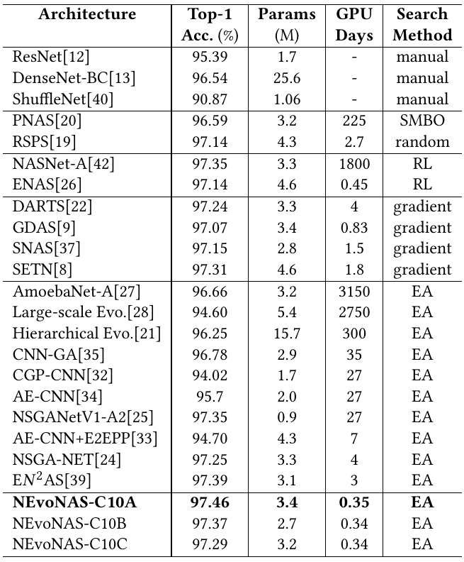</td>
  </tr>
  <tr>
     <th>Search Results on CIFAR-100</th>
  </tr>
  <tr>
    <td>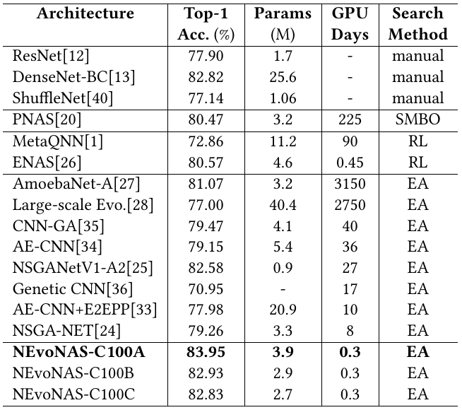</td>
  </tr>
  <tr>
     <th>Search Results on ImageNet</th>
  </tr>
  <tr>
    <td>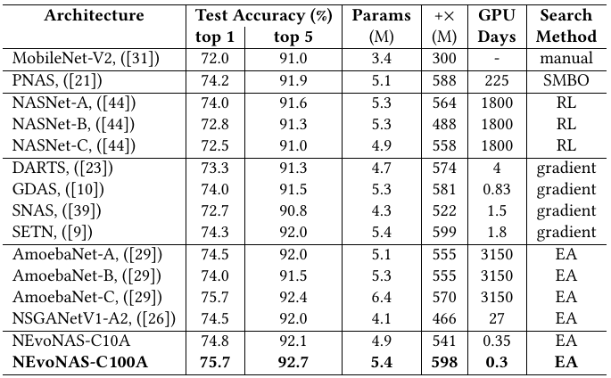</td>
  </tr>
</table>

#### Testing the discovered cells
```
bash ./s1/test_arch.sh cifar10 gpu_num data_dir batch_size genotype.pickle weights.pt outputs_dir
```
Replace cifar10 with cifar100 for testing the discovered cells on CIFAR-100. For ImageNet, use the following:

```
bash ./s1/test_imagenet.sh batch_size genotype.pickle data_dir imagenet_weight.tar
```

##### Best Discovered Cells on CIFAR-10
<table>
  <tr>
     <th>Normal Cell of NEvoNAS-C10A</th>
     <th>Reduction Cell of NEvoNAS-C10A</th>
  </tr>
  <tr>
    <td>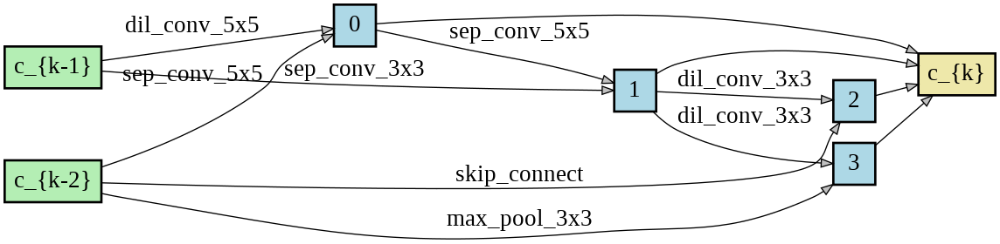</td>
    <td>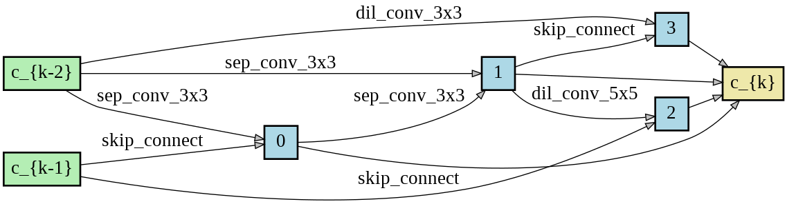</td>
  </tr>
</table>
<table>
  <tr>
     <th>Normal Cell of NEvoNAS-C10B</th>
     <th>Reduction Cell of NEvoNAS-C10B</th>
  </tr>
  <tr>
    <td>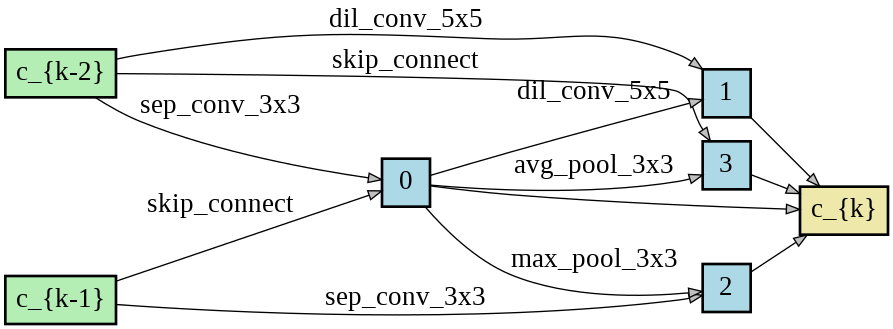</td>
    <td>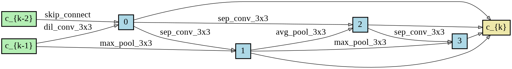</td>
  </tr>
</table>
<table>
  <tr>
     <th>Normal Cell of NEvoNAS-C10C</th>
     <th>Reduction Cell of NEvoNAS-C10C</th>
  </tr>
  <tr>
    <td>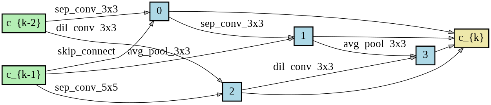</td>
    <td>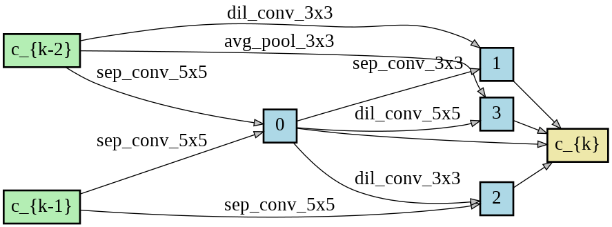</td>
  </tr>
</table>

##### Best Discovered Cells on CIFAR-100
<table>
  <tr>
     <th>Normal Cell of NEvoNAS-C100A</th>
     <th>Reduction Cell of NEvoNAS-C100A</th>
  </tr>
  <tr>
    <td>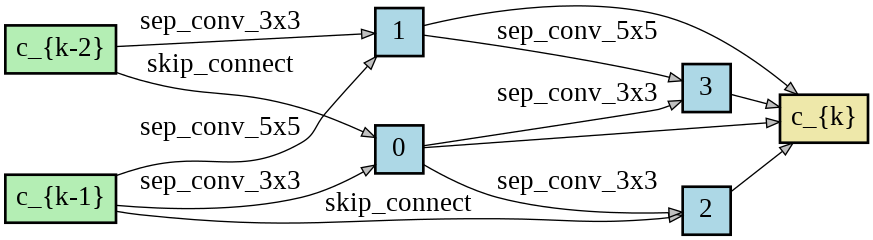</td>
    <td>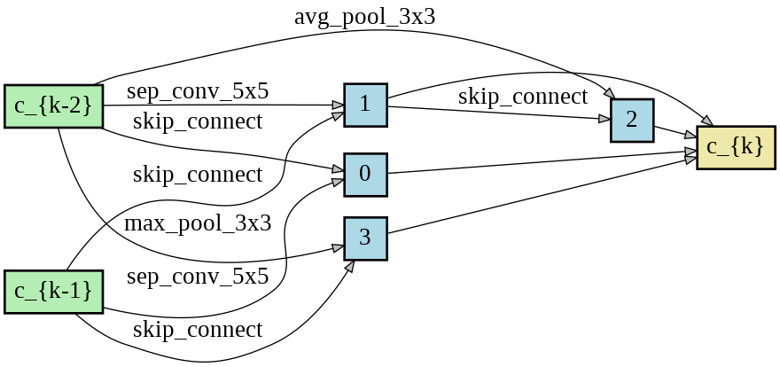</td>
  </tr>
</table>
<table>
  <tr>
     <th>Normal Cell of NEvoNAS-C100B</th>
     <th>Reduction Cell of NEvoNAS-C100B</th>
  </tr>
  <tr>
    <td>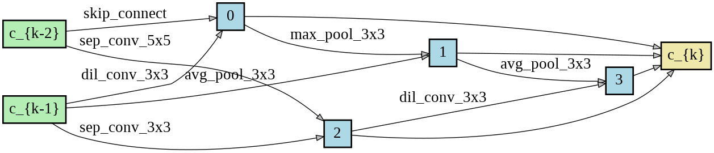</td>
    <td>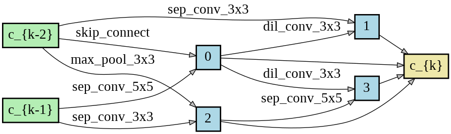</td>
  </tr>
</table>
<table>
  <tr>
     <th>Normal Cell of NEvoNAS-C100C</th>
     <th>Reduction Cell of NEvoNAS-C100C</th>
  </tr>
  <tr>
    <td>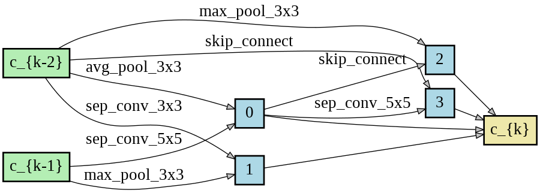</td>
    <td>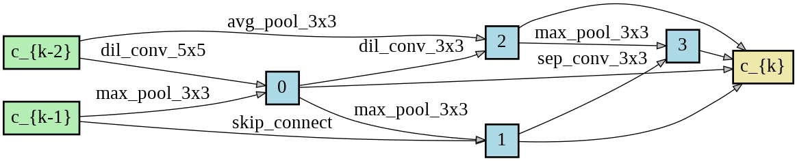</td>
  </tr>
</table>

## Search Space S2
This search space is similar to the one used in [NAS-BENCH-201](https://github.com/D-X-Y/NAS-Bench-201).
### Dataset
To download ImageNet-16-120 use the [link](https://drive.google.com/drive/folders/1T3UIyZXUhMmIuJLOBMIYKAsJknAtrrO4). To use the NAS-201
benchmark for evaluating the search method, download the file [NAS-Bench-201-v1_1-096897.pth](https://drive.google.com/file/d/16Y0UwGisiouVRxW-W5hEtbxmcHw_0hF_/view)

### Architecture search by NEvoNAS
Using CIFAR-10, CIFAR-100, ImageNet16-120:
```
 bash ./scripts/s2/arch_search.sh cifar10 gpu_num outputs_dir NAS-Bench-201-v1_1-096897.pth data_path
 bash ./scripts/s2/arch_search.sh cifar100 gpu_num outputs_dir NAS-Bench-201-v1_1-096897.pth data_path
 bash ./scripts/s2/arch_search.sh ImageNet16-120 gpu_num outputs_dir NAS-Bench-201-v1_1-096897.pth data_path
```
#### Results
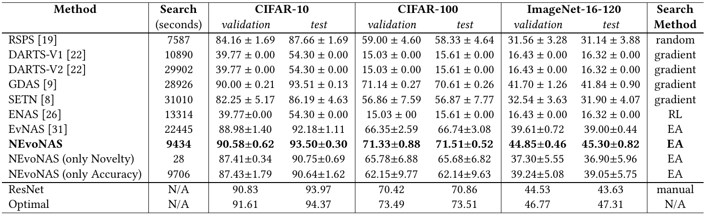
